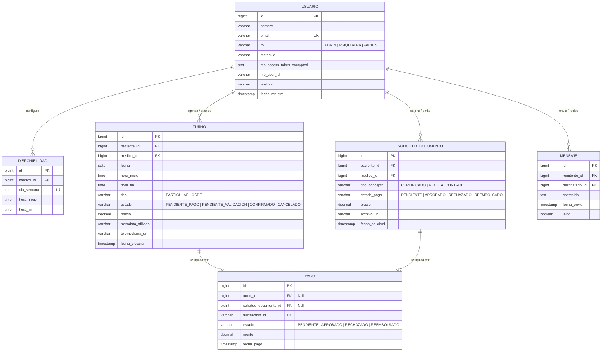

# Diseño de Base de Datos - Tranqui App (MVP - V1)

Este documento detalla la estructura lógica, las tablas, las restricciones y las relaciones del motor de base de datos relacional PostgreSQL de **Tranqui App**.

---

## 1. Diagrama de Relaciones (ER)

El siguiente diagrama Mermaid representa la estructura de las tablas y sus llaves foráneas:

---

## 2. Detalle de Tablas y Diccionario de Datos

### A. Tabla `usuario`
Almacena todos los usuarios que acceden al sistema.
*   `id` (BIGSERIAL, PK): Identificador único autoincrementable.
*   `nombre` (VARCHAR(100)): Nombre completo del usuario.
*   `email` (VARCHAR(150), Unique): Email de registro y acceso (Google OAuth2).
*   `rol` (VARCHAR(20)): Rol de usuario. Restringido por check constraint: `ADMIN`, `PSIQUIATRA`, `PACIENTE`.
*   `matricula` (VARCHAR(50), Nullable): Matrícula profesional (obligatorio para médicos).
*   `mp_access_token_encrypted` (TEXT, Nullable): Token de acceso descifrable a Mercado Pago (solo médicos).
*   `mp_user_id` (VARCHAR(50), Nullable): ID de usuario de Mercado Pago.
*   `telefono` (VARCHAR(30), Nullable): Número telefónico (para recordatorios de WhatsApp).
*   `fecha_registro` (TIMESTAMP): Fecha y hora en la que se dio de alta el usuario.

### B. Tabla `disponibilidad`
Representa los bloques horarios semanales disponibles que ofrece el médico para recibir turnos.
*   `dia_semana` (INT): Día de la semana representado del 1 (Lunes) al 7 (Domingo).
*   `hora_inicio` (TIME): Hora de inicio del bloque de atención.
*   `hora_fin` (TIME): Hora de finalización de atención (debe ser mayor a `hora_inicio`).

### C. Tabla `turno`
Guarda el registro de las citas particulares o bajo cobertura de obra social (OSDE).
*   `fecha` (DATE): Fecha de la cita.
*   `hora_inicio` / `hora_fin` (TIME): Bloque de tiempo de la cita (duración predeterminada de 45 minutos).
*   `tipo` (VARCHAR(20)): Clasificación del turno: `PARTICULAR` u `OSDE`.
*   `estado` (VARCHAR(30)): Estado actual: `PENDIENTE_PAGO` (bloqueo por 10 min), `PENDIENTE_VALIDACION`, `CONFIRMADO` o `CANCELADO`.
*   `metadata_afiliado` (VARCHAR(100), Nullable): Credencial de afiliación del paciente si seleccionó OSDE.

### D. Tabla `solicitud_documento`
Soporta las solicitudes de recetas de control y certificados médicos fuera de la agenda de consultas.
*   `tipo_concepto` (VARCHAR(30)): Tipo de documento: `CERTIFICADO` o `RECETA_CONTROL`.
*   `archivo_url` (VARCHAR(500), Nullable): Ubicación del archivo emitido (por ejemplo, firma digital en PDF).

### E. Tabla `pago`
Registra el cobro acreditado en Mercado Pago.
*   `transaction_id` (VARCHAR(100), Unique): Identificador provisto por la pasarela externa de Mercado Pago.
*   `chk_origen_pago` (CHECK CONSTRAINT): Restricción que garantiza que el registro de pago apunte a un `turno_id` o a un `solicitud_documento_id`, impidiendo la duplicidad de origen del dinero.

---

## 3. Estrategia de Indexación para Rendimiento
*   `idx_usuario_email`: Búsquedas indexadas directas en el flujo de inicio de sesión con Google.
*   `idx_turno_medico_fecha`: Optimiza la visualización de la agenda diaria de un médico específico y agiliza las comprobaciones de colisiones de turnos al reservar.
*   `idx_mensaje_chat`: Indexa de forma descendente (`DESC`) el historial de chat para acelerar la carga progresiva de los últimos mensajes enviados entre dos usuarios.
